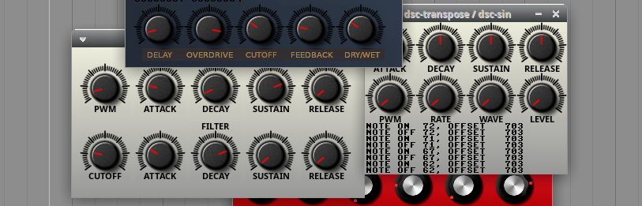

# RST used with ikiGUI
Together it's a small/tiny Cross Platform Audio Framework for Making/Programming Audio Plugins in C Code with GCC.
It can be used for making VST2 instruments/synthesizers and effects.

The focus is on small amout of code, understand and take control of your codebase, and fast workflow.

It can compile 32bit and 64bit plugin versions of Windows and Linux.
And it can even cross compile plugins for Windows on Linux.
It uses it's own API that is compatible with the VST2.4 ABI so the plugs can be used in the most amount of music programs and even older ones.

It will let you have code for several plugins in the same catalouge for convinience.

The examples uses ikiGUI for the graphical plugin editors.

Information about ikiGUI can be found here ... https://github.com/logos-maker/ikiGUI
- Cross compiles 100% identical code to Linux and Window
- Super small codebase in 100% C code
- Uses 32bit bitmap graphics (24bit color with 8bit alpha channel)
  
## Compilation on Windows
MinGW-w64 can be used to compile the code on Windows. I would recommend downloading [TDM-GCC](https://jmeubank.github.io/tdm-gcc/articles/2021-05/10.3.0-release) and downloading the installer named tdm64-gcc-10.3.0-2.exe Then after that you should be able to compile from the CMD Command Prompt. You can compile to generate a plugin .dll with a command like...
```
gcc plug_template.c -o ./bin/plug_template.dll -fPIC -shared -lm -lGDI32
```
If you don't want to use the CMD Command Prompt you can use a text editor that can run the single command needed for compilation is for example [Geany](https://www.geany.org/) or [Sublime Text](https://www.sublimetext.com/).

## Compilation on Linux
It can easily be done with a command like...
```
gcc plug_template.c -o ./bin/plug_template.so -fPIC -shared -lm
```
If you want to compile 32bit linux plugins on a 64bit machine install...
```
sudo apt-get install gcc-multilib
```
...and use the -m32 flag for GCC with a command like...
```
gcc plug_template.c -o ./bin/plug_template.so -fPIC -shared -lm -m32
```
### If you want to cross compile to Windows
Install the needed compiler commands with...
```
sudo apt -y install mingw-w64
```
If you want a 64-bit Windows plugin compile with a command like...
```
x86_64-w64-mingw32-gcc generic_fx_code.c -o ./bin/plugin.dll -fPIC -shared -lgdi32 -lm
```
And if you want to make 32bit Windows plugs use a command like...
```
i686-w64-mingw32-gcc generic_fx_code.c -o ./bin/plugin.dll -fPIC -shared -lgdi32 -lm
```
